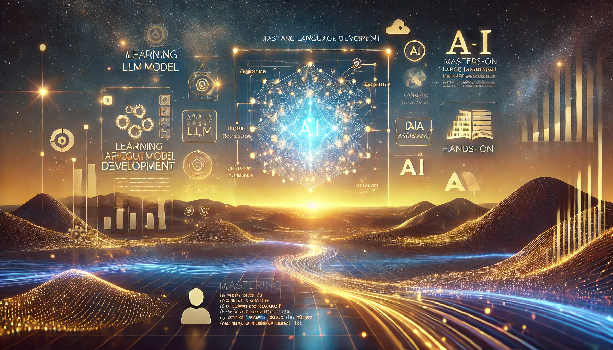

# LLM Development Course Course Repository

 
Welcome to the **LLM Development Course Repository**! This repository is designed to guide you through a comprehensive journey into the world of artificial intelligence, focusing on large language models, prompt engineering, multimodal applications, and more. Whether you're a beginner or an experienced developer, you'll find valuable resources and hands-on projects to enhance your skills.

## Course Content

1. **Introduction to Large Language Models with GPT & LangChain**  
   Get started with the basics of large language models and how to leverage GPT and LangChain for various applications.

2. **Prompt Engineering with GPT and LangChain**  
   Learn the art and science of crafting effective prompts to maximize the performance of language models.

3. **Building Multimodal AI Applications with LangChain & the OpenAI API**  
   Explore how to create AI applications that can process and understand multiple types of data inputs.

4. **Semantic Search with Pinecone**  
   Dive into semantic search techniques using Pinecone to enhance search capabilities in your applications.

5. **Using Retrieval-Augmented Generation to Search a Movie Database**  
   Implement retrieval-augmented generation to build a powerful search engine for a movie database.

6. **Building Chatbots with the OpenAI API and Pinecone**  
   Develop intelligent chatbots by integrating the OpenAI API with Pinecone for enhanced conversational experiences.

7. **Using Open Source AI Models with Hugging Face**  
   Discover how to utilize open-source AI models available on Hugging Face for various tasks.

8. **Building NLP Applications with Hugging Face**  
   Learn to build natural language processing applications using Hugging Face's powerful tools and models.

9. **Image Classification with Hugging Face**  
   Gain hands-on experience in image classification tasks using Hugging Face's state-of-the-art models.

10. **Getting Started with Data Pipelines for ETL**  
    Understand the fundamentals of data pipelines and ETL (Extract, Transform, Load) processes to manage and process data efficiently.

## Getting Started

To get started with any of the courses, simply navigate to the respective directory and follow the instructions provided in the README files. Each course includes code examples, datasets, and detailed explanations to help you grasp the concepts and apply them in real-world scenarios.

## Prerequisites

- Basic understanding of Python programming.
- Familiarity with machine learning concepts is helpful but not mandatory.
- Access to an OpenAI API key for certain modules (optional for open-source alternatives).

Narvik Aghamalian, Feb/2025
